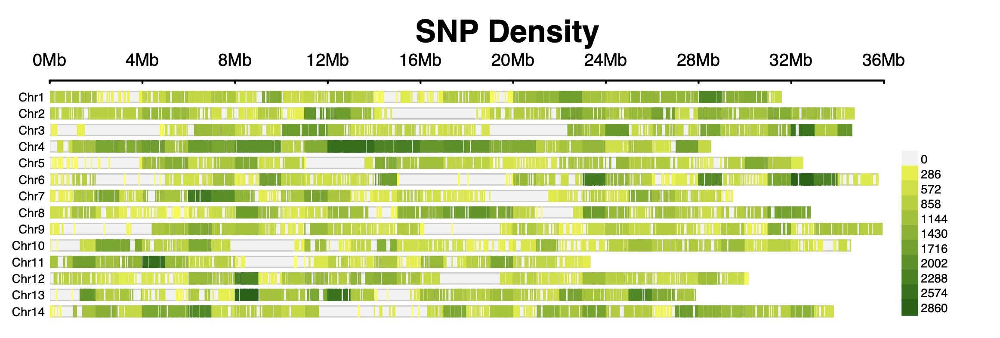

# Genomic diversity of Elm trees (Ulmus species)
This repo shares scripts used to analyze whole-genome sequences of elms. 

SNP-density plot for elm samples using [CMplot](https://github.com/YinLiLin/CMplot).

For the details about the project, please see the project page at the [Center for Forest Protection](https://www.forestprotection.uk/project/2209-distribution-and-diversity-of-existing-uk-elms/).

---

- Check the checksum of downloaded files using ‘md5sum’ or similar
- Run FASTQC on raw files for quality control
- Trim the raw files using [Trimmomatic](https://github.com/timflutre/trimmomatic), [FASTP](https://github.com/OpenGene/fastp) or [Cutadapt](https://cutadapt.readthedocs.io/en/stable/).
- Run FASTQC on trimmed files.
- Run [MultiQC](https://github.com/MultiQC/MultiQC) to aggregate FASTQC results into a single HTML file (raw and trimmed separately) for better visualization. Check the “Sequence GC content”, “Overrepresented sequences”, “Adapter Content”, etc. Exclude erroneous sample(s).
- Map the raw reads against the reference genome, *Ulmus americana* [GCA_010015005.3](https://www.ncbi.nlm.nih.gov/datasets/genome/GCA_010015005.3/) using [BWA version 2](https://github.com/bwa-mem2/bwa-mem2) ‘mem’ algorithm.
- 

